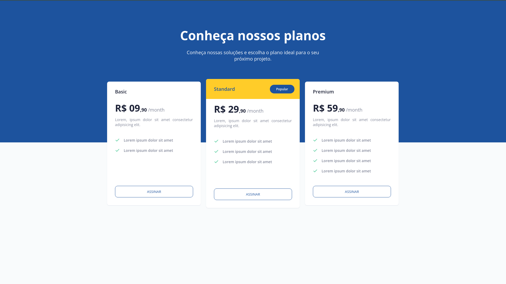

<h1 align="center">Pricing Table</h1>

    Desafio: Pricing Table by equipe Rocketseat 💜

    <a href="#-tecnologias">Tecnologias</a>&nbsp;&nbsp;&nbsp;|&nbsp;&nbsp;&nbsp;
    <a href="#-projeto">Projeto</a>&nbsp;&nbsp;&nbsp;|&nbsp;&nbsp;&nbsp;
    <a href="#-layout">Layout</a>

 

    

 

## 🚀 Tecnologias

Esse projeto foi desenvolvido com as seguintes tecnologias:

- HTML
- CSS

## 💻 Projeto

Neste desafio foi desenvolvido uma página com uma tabela com as opções de preços/planos do produto/serviço.
OBS: O Layout está responsivo!

## 📋 Layout 

Voce pode visualizar o layout do projeto atraves [DESSE LINK](https://www.figma.com/file/sSq019RDznSm3eyZoo3OHc/DD-Pricing-Table/duplicate). E necessario ter conta no [Figma](https://figma.com) para acessa-lo.

---

Feito com 💜 by Phelipe Pereira :wave:
